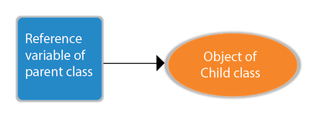

//Note: Multiple inheritance is not supported in Java through class.
//In java programming, multiple and hybrid inheritance is supported through interface only. 
## what is class and object's in java 
```
  1. In java, a class is a blueprint or template for  creating   objects,
  2. And an object an instance of a class. 
  3. Any Entity that has state and behavior is know as object.
  4. For example: a chair, pen, table, keyboard, bike etc..
```

## piller of oops 

### 1. Inheritance=> 
   ```
    a. When an object acquires all the properties and behavours of a parent object, it is known as inheritance.
    b. it provides code reusability.
    c.it is used to achive runtime polymorphism.

   ```
### 2. Polymorphism 
 ```
 a.If one task is perfomed in different ways, it is know as polymorphism. 
 b.In java, we used method overloading and method overriding to achieve polymorphism. 
 
 ```
### 3. Abstraction 
  ```
    a. Hiding internal details and showing functionality is known as abstraction. For example phone call, we don't know the internal processing.
    b.In Java, we use abstract class and interface to achieve abstraction.
  ```
### 4. Encapsulation 
 ```
   a. Binding (or wrapping) code and data together into a single unit are known as encapsulation. For example, a capsule, it is wrapped with different medicines.
   b.A java class is the example of encapsulation. Java bean is the fully encapsulated class because all the data members are private here.
 ```

 # Characteristics of Object

 <b>A.State =</b> Represent the data of an object <br>
 <b>B.Behavior =</b> Represents the behavior of an object such as deposit, withdraw,etc.<br>
 <b>C.Identity =</b> It is used internally by the JVM to identify each object uniquely.<br>

# Syntax to declare a class:

<code> 
 classs Class_Name { <br>
    field; <br>
    method;<br>
    constructor;<br>
    blocks<br>
    nested classes or interface<br> 

 }
</code>

# Instance variable in Java
```
1. A variable which is created inside the class but outside the method is known as an instance variable.
2. Instance variable doesn't get memory at compile time.
3. It gets memory at runtime when an object or instance is created.

```

# new keyword

```
  1  The new keyword is used to allocate memory at runtime. 
  2. All objects get memory in Heap memory area.
```


## 3 Ways to initialize object
There are 3 ways to initialize object in Java.

By reference variable <br>
By method <br>
By constructor <br>

# What are the different ways to create an object in Java?
#### There are many ways to create an object in java. They are:

By new keyword <br>
By newInstance() method <br>
By clone() method <br>
By deserialization <br>
By factory method etc.<br>

# Constructor 

```
 1. Constructor is a special method having the same name as the class name. 
 2. constructor have no any return type 
 3. construcotor are of two type A . Non-parametrized constructor B. Parameratrized constructor.
 4. constructor is used to initiate the object. 
 5. if their is no any constructor present in the class JVM Automatically added a default constructor.

```
# function overloading 

```
  1. function overloading is the process of performing the multiple task with the same function by varying the number of parameter of the function/method. 

            # OR
If a class has multiple methods having same name but different in parameters, it is known as Method Overloading.
```

## Different ways to overload the method

#### There are two ways to overload the method in java

1. By changing number of arguments
2. By changing the data type
3. not possible by changing return type due to ambiguity problem

# method overriding 

```
1. If subclass (child class) has the same method as declared in the parent class, it is known as method overriding in Java.
```

## importance of overriding 

1. Method overriding is used to provide the specific implementation of a method which is already provided by its superclass.
2. Method overriding is used for runtime polymorphism

# Rules for Java Method Overriding


a. The method must have the same name as in the parent class <br>
b. The method must have the same parameter as in the parent class.<br>
c. There must be an IS-A relationship (inheritance).

# static keyword in java

````
1. static keyword is basically used for the memory management/optimization.

2. it can be use during the variable creation(know as instance variable) , in the method creation(also know as class mehod)

3. The static variable gets memory only once in the class area at the time of class loading.

4.The static variable can be used to refer to the common property of all objects (which is not unique for each object), for example, the company name of employees, college name of students, etc.
````
## Advantages of static variable
It makes your program memory efficient (i.e., it saves memory).
***

#### for example visit the links : => https://www.javatpoint.com/static-keyword-in-java

<br>

# this(Reference Variable) keyword in Java

 ```
 1.  In Java, this is a <b>reference variable<b> that refers to the current object.

 ```
 ## Usage of Java this keyword

 ```
 1. this can be used to refer current class instance variable.(i.e:to remove the ambiguity if the parameter and instance variable having same name)

 2. this can be used to invoke current class method (implicitly)

 3. this() can be used to invoke current class constructor.(it is used for constructor chaining OR  It is used to reuse the constructor. )

 // you have to only know  three usages  

 4. this can be passed as an argument in the method call.

 5. this can be passed as argument in the constructor call.

 6. this can be used to return the current class instance from the method.

 Notes : for example see the ConceptOfThisKeyword in the repo 

 https://github.com/jigneshsharma123/javaString-Practice
 ```
 # @To study more about the types of inheritance in java 

 visit : https://www.javatpoint.com/inheritance-in-java

 ## Covariant Return Type

 ```
 1. This feature was introduced in Java 5.
 2. it is possible to override method by changing the return type if subclass overrides any method whose return type is Non-Primitive but it changes its return type to subclass type.

 ```

#### example 


``` 
class Animal {
    Animal get() {
        return this;
    }
}

class Dog extends Animal {
   @Override
    Dog get() {
        return this;
    }
}


```

## Super Keyword in Java
```

1. The super keyword in Java is a reference variable which is used to refer immediate parent class object.


2. Whenever you create the instance of subclass, an instance of parent class is created implicitly which is referred by super reference variable.

```

#### Usage of Java super Keyword
```
A. uper can be used to refer immediate parent class instance variable.

B. super can be used to invoke immediate parent class method.

c. super() can be used to invoke immediate parent class constructor.

```

#### Final Keyword In Java

```
1. The final keyword in java is used to restrict the user.

2. Final can be (Var, method, and class)
```


# Polymorphism in java
```
1. Polymorphism in Java is a concept by which we can perform a single action in different ways.

2.Let's first understand the upcasting before Runtime Polymorphism.

class A{}  
class B extends A{}  
A a=new B();//upcasting  
```



#### Example of Java Runtime Polymorphism

```
class Bike{  
  void run(){System.out.println("running");}  
}  
class Splendor extends Bike{  
  void run(){System.out.println("running safely with 60km");}  
  
  public static void main(String args[]){  
    Bike b = new Splendor();//upcasting  
    b.run();  
  }  
}  
//op=> running safely with 60km.
```
## downcasting by typecasting

```
Dog d=new Animal();//Compilation error  
Dog d=(Dog)new Animal();  
//Compiles successfully but ClassCastException is thrown at runtime  

```

## Abstract class in Java

```
1. A class which is declared with the abstract keyword is known as an abstract class in Java. 

2. Abstraction is a process of hiding the implementation details and showing only functionality to the user.

3. There are two ways to achieve abstraction in java

a. Abstract class (0 to 100%)
b. Interface (100%)
```
